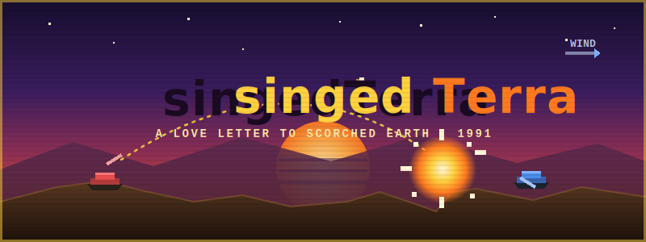
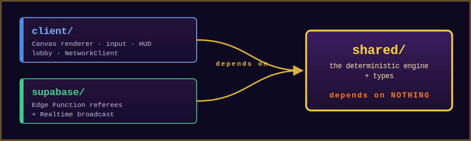
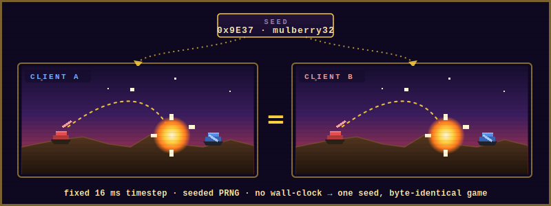

<!-- singedTerra — README -->
<p align="center">
  
</p>

<h1 align="center">singedTerra</h1>

<p align="center">
  <em>A browser-based, turn-based artillery duel, and a love letter to <strong>Scorched Earth</strong> (1991).</em>
</p>

<p align="center">
  
  
  
  
  <a href="https://github.com/SUaDtL/singedTerra/actions/workflows/ci.yml"></a>
  
  
</p>

---

## A love letter to Scorched Earth

In 1991, Wendell Hicken's **Scorched Earth** (*"The Mother of All Games"*) taught a generation
that the most fun you could have with a PC was lobbing a Baby Missile over a procedurally-generated
hill, missing by *that much*, watching the wind flip on you, and adjusting your angle by one degree.
Funky Bombs. Dirt Clods. The Death's Head. Buying shields between rounds with money you didn't really have.

**singedTerra** is my homage to that game. Not a fork, not a reskin. It's a from-scratch rebuild in
modern TypeScript that chases the *feel*: the satisfying arc, the destructible ground, the cruel wind,
the "one more turn" of a hot-seat match. It aims to feel a touch nicer than the VGA original
(smoother bursts, a readable HUD) **without** losing the charm of geometric tanks and a terrain you
can blow a hole straight through.

> The name is a play on the original: *singed earth* for *Scorched Earth*. 🔥

---

## What it is

- 🎯 **Turn-based artillery**: aim by angle (`0°=right, 90°=up`) and power (`0–100`), account for wind, fire.
- ⛰️ **Truly destructible terrain**, a per-pixel bitmap. Craters are real holes; tanks get **buried**, slide, and fall when the ground under them is blown away.
- 🌬️ **Cruel, fair wind**: a gentle per-turn drift (seeded, never random) that nudges every shell sideways.
- 🧨 **The full arsenal**. All **11 weapons** live, each with its own blast, color, and behavior, on a credit economy with finite ammo.
- 🏆 **Best-of-N matches**: multi-round matches with a scoreboard (kills, damage, rounds won), a between-rounds shop, and a persisted final result.
- 🤖 **Computer opponents**: a deterministic shot-planner (easy/medium/hard), playable hot-seat *and* online.
- 👥 **Two ways to play**: *hot-seat* (2–4 players, one tab) and *online* (each player on their own browser) over Supabase.
- 🧮 **Deterministic by design**. The same seed + the same inputs always produce byte-identical results. This is the whole architecture (see below).
- 🪶 **No game framework, no GPU**: vanilla TypeScript + the Canvas 2D API. Runs happily on a t3.micro.

---

## Controls

| Input | Action |
|---|---|
| `←` / `→` | Adjust **angle** |
| `↑` / `↓` | Adjust **power** |
| `Space` / `Enter` | **Fire** |
| `Tab` / `Q` | Cycle weapon (accelerator) |
| **Click the weapon strip** | Select a weapon directly (shows live ammo), including the **Shield** |
| **Store panel** | Buy weapons with credits (mid-turn, and per-tank in the between-rounds shop) |
| **Menu** (side panel) / **Main Menu** (game-over) | Quit the game back to the lobby |

Input is accepted only on your turn, only while aiming, never mid-flight.

---

## The arsenal

Each weapon is a data definition (`shared/src/engine/WeaponSystem.ts`): a **detonation** profile (radius,
damage, color, burst style) and an optional **behavior** (airburst split, bounce, lingering fire…). The
engine's single `detonate()` primitive reads them, so new weapons are mostly data, no new draw code.

| # | Weapon | Blast | Notes |
|--:|---|---|---|
| 1 | 🟠 **Baby Missile** | r18 · 34 dmg | The starter. **Unlimited** ammo. ~3 hits to kill. |
| 2 | 🔶 **Missile** | r30 · 60 dmg | ~2 hits. The reliable workhorse. |
| 3 | 🔥 **Heavy Missile** | r50 · 85 dmg | Big single shell. |
| 4 | 🟤 **Dirt Bomb** | r50 · *raises* terrain | Builds cover instead of cratering it. |
| 5 | 🟡 **Cluster Bomb** | 5 × r18 · 28 dmg | **Apex airburst**: splits at the top of its arc into a falling carpet. |
| 6 | ☢️ **Baby Nuke** | r65 · 90 dmg | Heavy area damage. |
| 7 | 💥 **Nuke** | r90 · 100 dmg | A near-direct hit is a one-shot kill. |
| 8 | 🟣 **Bouncing Betty** | r30 · 55 dmg | A **bounding mine** that detonates a full blast at *every* hop along the terrain, not a silent ball. |
| 9 | 🟪 **Funky Bomb** | 5 × split | Mid-flight (non-apex) age-triggered 5-way split. |
| 10 | 🟧 **Napalm** | r40 fire field | A **spreading, lingering fire**: a downhill-flowing damage-over-time field, no crater. |
| 11 | 🔵 **Shield** | defensive | A destructible particle **force field** (`use_shield`) that absorbs a pool of incoming damage and ends your turn. |

**Economy.** Tanks start with `STARTING_CREDITS`, earn `CREDITS_PER_DAMAGE` per point of damage dealt
to opponents plus a flat `TURN_STIPEND` each shot, and spend them via a turn-neutral `buy` action.
Inventory (`{ count, unlimited }`) and credits **carry between rounds**, so the between-rounds shop has
teeth. Firing a finite weapon is rejected at zero and decrements on success (deterministically), so it
survives networked replay. Prices/bundles are mapped from the canonical 1991 catalog (`docs/reference/`).

---

## Match structure (best-of-N)

A match is **best-of-N rounds** (configurable odd N via the lobby's Advanced settings; default 1 =
single skirmish). Each round is a full duel on fresh terrain; first to clinch ⌈N/2⌉ round wins takes
the match.

- **Carries between rounds:** credits, purchased inventory, round wins, and the scoreboard (kills + damage).
- **Resets each round:** health, shield, fuel, positions, terrain (regenerated from a per-round *derived* seed).
- **Between-rounds shop:** a `ROUND_OVER` pause opens a per-tank shop; a `next_round` action begins combat.
- **Scoreboard:** a round indicator, per-player round-win pips, a transition banner, and a final table.
- **Persistence:** the final standings are written once to a Postgres `match_scores` table at game-over.

The round transition is a **pure deterministic function of (seed, round number, action log)**, so
networked lockstep replays it identically on every client, with no special-cased state shipped over the wire.

---

## Architecture: one engine, two execution contexts

The single most important design rule:

> **All game logic lives in `shared/` and runs in exactly one of two places.**

<p align="center">
  
</p>

- **Hot-seat:** the browser runs `shared/engine/*` directly via `HotSeatClient`: zero network, zero round-trips. `GameEngine` ticks on `requestAnimationFrame`.
- **Online:** **deterministic lockstep** over Supabase, *not* a server-authoritative tick. Every client runs its own `GameEngine`, seeded identically. The canonical game is **seed + an ordered action log** (`room_actions`). A turn-ending/buy action is POSTed to the `submit_action` Edge Function, which acts as a thin **referee**: it validates turn ownership and allocates the next `seq`; **it does not run physics**. Supabase **Realtime** broadcasts each committed row, and every client applies it to its local engine in `seq` order, so all clients stay in sync without anyone shipping `GameState` over the wire. CPU seats are client-driven: every client computes the same deterministic plan and submits it, with the `UNIQUE(room_id, seq)` constraint + the referee cursor making it exactly-once.

`GameClient` hides which mode you're in from the renderer and input layers (`HotSeatClient` vs
`NetworkClient`). That's *why* physics and types live in `shared/`, so every engine is the same code
and they can never drift apart.

### Determinism is a hard requirement

Lockstep only works if every machine computes identically. So the engine obeys strict rules:

- **Fixed 16 ms timestep**: hot-seat and networked produce identical results.
- **No `Math.random`, no `Date.now`, no wall-clock** anywhere in `shared/`.
- All randomness (terrain, wind, per-round seeds) flows from a **seeded `mulberry32` PRNG** with MurmurHash3 seed mixing. Same seed ⇒ same game, every time.

<p align="center">
  
</p>

### Why a pixel bitmap for terrain?

Terrain is a **`Uint8Array` of `800 × 500`** (one byte of solidity per pixel: `0` = air, non-zero = solid),
rasterized from a midpoint-displacement height-map silhouette. A point collides when its pixel is solid, at
`O(1)`. Explosions clear a disc of pixels (a real hole); the Dirt Bomb sets them; gravity collapses
unsupported columns and **buries** tanks. It serializes as plain bytes for the action-log world, and the
renderer only re-rasterizes the terrain polygon when a dirty (version) flag changes, meaningful CPU
savings on a small box.

---

## The determinism harnesses

`npm run check` runs the full typecheck plus **47 deterministic test harnesses** (`scripts/checks/`).
They are the project's safety net. Every change must keep them green. A representative selection:

| Harness | Proves |
|---|---|
| `determinism` | Same `(seed, actions)` ⇒ byte-identical final state |
| `collision` | OOB / ground / tank / swept-collision correctness (no tunneling) |
| `timestep` | Ticking is batch-invariant: no clock-derived `dt` |
| `turnstate` | Turn order, wind, health & winner reproducible for N=2/3/4 |
| `airburst` | Cluster splits into a deterministic symmetric fan; resolves once |
| `wind` | Seeded wind sequence reproducible; within cap; drift-bounded |
| `ammo` | Ammo gating + decrement; live vs. replay byte-identical |
| `motion` | Bounce reflection, funky age-split & napalm fan: deterministic + replay-identical |
| `shield` | Shield absorption pool + `use_shield` turn-ending semantics |
| `store` | Credit economy: earnings, affordability gating, buy decrement |
| `ai` | Deterministic shot-planner: AI-vs-AI resolution, difficulty ordering, edge cases |
| `lockstep` | Out-of-order buffered actions apply in `seq` order; nothing dropped |
| `turn_rotation` | Death-aware turn rotation skips eliminated seats; fresh-replay agreement |
| `rounds` | Best-of-N advance/clinch; carry vs. reset; multi-round determinism |
| `scoreboard` | Shooter-attributed kills + damage (overkill/self excluded); carry across rounds |
| `netrounds` | Networked round-boundary + per-tank-buy lockstep through the shared replay path |

_…and 31 more: terrain collapse, batteries, interest, sudden-death, arms level, resync guard,
net-retry, chunked replay, `clamp`/PRNG primitives, and more._

---

## Quickstart

```bash
npm install            # install all workspaces (client + shared)

npm run dev            # Vite dev server (client) on :5173
npm run dev:client     # same

npm run build          # typecheck + vite client build -> client/dist
npm run typecheck      # typecheck shared + client
npm run check          # typecheck + all 47 determinism harnesses  ← run before every commit
```

> Requires Node 20 LTS. Online play needs Supabase keys in `client/.env`
> (`VITE_SUPABASE_URL`, `VITE_SUPABASE_ANON_KEY`). Copy `client/.env.example`. Hot-seat needs nothing.

---

## Deployment

The client is a static Vite bundle; the backend is Supabase (no Node app server).

- **Client** → **GitHub Pages**, published automatically by `.github/workflows/deploy-pages.yml` on every push to `main` (built with the project-site base path). One-time setup:
  1. **Settings → Pages → Source: “GitHub Actions”.**
  2. **Settings → Secrets and variables → Actions**, add `VITE_SUPABASE_URL` and `VITE_SUPABASE_ANON_KEY` (inlined into the public bundle at build; the anon key is RLS-gated and safe to expose; see ADR-0006). Without them the site still builds and hot-seat play works; networked play needs them.

  The site lands at `https://<owner>.github.io/<repo>/`. Any static host at the domain root also works (the base defaults to `/`); `nginx.conf` is a sample config.
- **Backend** → **Supabase**: Edge Functions (`supabase/functions/`), Postgres (`rooms`, `room_actions`, `match_scores`), and Realtime (the action-log broadcast). Migrations live under `supabase/migrations/`.

```bash
npm run deploy          # backend only: db push + deploy all Edge Functions (client ships via Pages CI)
npm run deploy:backend  # same as above
```

---

## Project layout

```
singedTerra/
├── shared/                 # the deterministic engine + types — depends on NOTHING
│   └── src/
│       ├── engine/         # GameEngine · Physics · Terrain · Tank · WeaponSystem · AI · Random
│       ├── net/            # replayNetworkAction — the canonical action-log → engine translation
│       └── types/          # GameState · PlayerAction · GameOptions
├── client/                 # Canvas renderer, input, HUD, lobby (Vite)
│   └── src/
│       ├── renderer/       # Terrain / Tank / Projectile / HUD renderers + draw loop
│       ├── client/         # GameClient · HotSeatClient · NetworkClient
│       ├── input/  ui/  lib/
├── supabase/               # Edge Functions (submit_action referee, rooms, lobby) + migrations
├── scripts/checks/         # the 47 determinism harnesses
└── docs/                   # SPEC · TASKS · sprint plans · reference · assets
```

---

## What the action-log design buys us

Because the canonical game is just *(seed + a replayable action log)* (see [Architecture](#architecture-one-engine-two-execution-contexts)), several features fall out of the model rather than needing to be built:

- **Reconnect for free**: a dropped client re-fetches the log and replays it back to byte-identical state; no session to restore.
- **Spectating**: a viewer is a client that replays the log and never submits.
- **Async / correspondence turns**. The log doesn't care how much wall-clock passes between rows.

The same property is why nothing but the log is ever shipped over the wire, and why a wrong client-reported next-seat index self-corrects instead of desyncing.

---

## Status & roadmap

| Phase | State |
|---|---|
| **MVP0**: Bones (terrain, tanks, ballistics, craters) | ✅ Done |
| **MVP1**: It's a Game (turns, health, wind, HUD, hot-seat 2–4) | ✅ Done |
| **MVP2**: Networked (Supabase lockstep, lobbies, rooms) | ✅ Done |
| **Sprint 4**: Combat Depth (ammo, nukes, weapon strip, new-motion weapons, shield) | ✅ Done |
| **Sprint 5**: Graphical overhaul (banner art direction, CRT, juice, side-panel HUD) | ✅ Done |
| **Sprint 6**: V1 match structure (best-of-N rounds, scoreboard, between-rounds shop, score persistence) | ✅ Done · live |
| **V1 (remaining)**: fuel/movement, turn timer, audio, mobile HUD, terrain-type options, session score history | ⏳ Planned |

The living register is [`docs/TASKS.md`](docs/TASKS.md); the full design is [`docs/SPEC.md`](docs/SPEC.md);
recent sprint plans live in [`docs/`](docs/) (older ones archived under [`docs/archive/`](docs/archive/)).

---

## Tech stack

**TypeScript** (strict, throughout) · **Canvas 2D** (no game framework) · **Vite** (client) ·
**Supabase** (Postgres + Realtime + Edge Functions, lockstep netcode) · **GitHub Pages** (static client host) ·
**npm workspaces** monorepo · zero runtime dependencies in the game engine.

---

## Contributing

Contributions are welcome. See [`CONTRIBUTING.md`](CONTRIBUTING.md) for setup and the one rule that
matters most here (**determinism**: the engine must replay identically across clients). Bugs and ideas
go through the issue templates; security reports go privately via [`SECURITY.md`](SECURITY.md). Be
excellent to each other: [`CODE_OF_CONDUCT.md`](CODE_OF_CONDUCT.md).

---

## Homage & credits

Built with deep affection for **Scorched Earth** by **Wendell Hicken** (1991), and the whole lineage of
artillery games it inspired: *Worms*, *Pocket Tanks*, *Gunbound*. The tanks here are geometric, the
explosions are pure canvas, and the wind will still betray you. That's the point.

> *singedTerra*: a personal project and a tribute. Not affiliated with or endorsed by the original authors.
