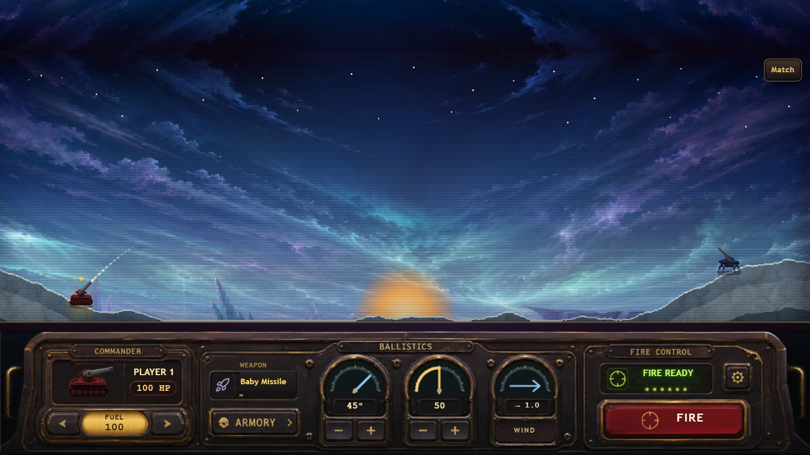
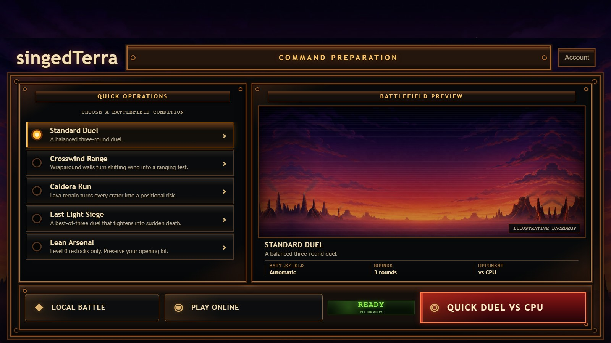
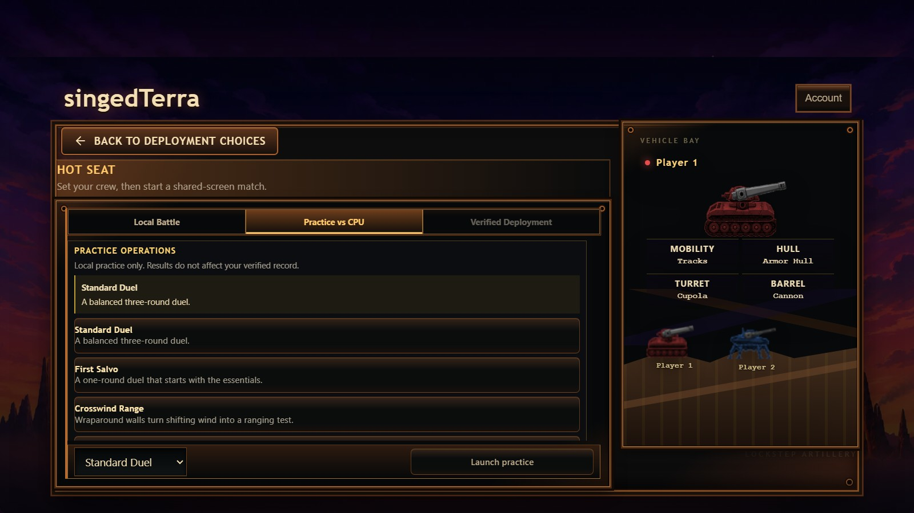
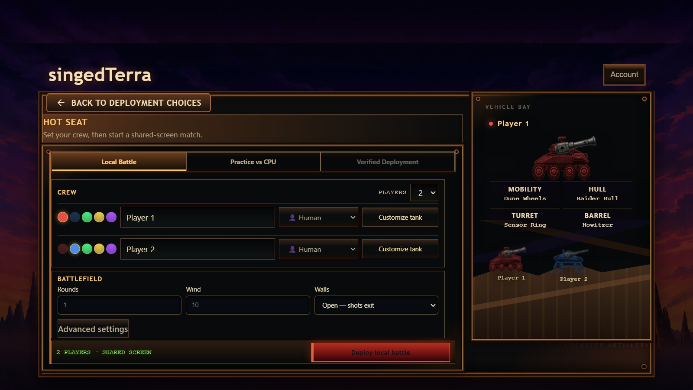
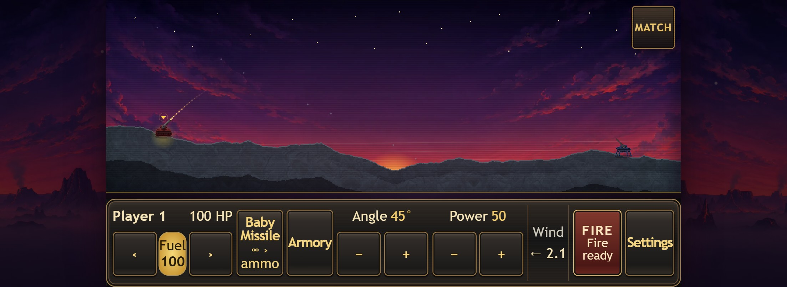

<p align="center">
  
</p>

<h1 align="center">singedTerra</h1>

<p align="center">
  <strong>A browser artillery game with old-school consequences.</strong><br />
  Read the wind. Shape the ground. Spend carefully. Make the shot count.
</p>

<p align="center">
  <a href="https://suadtl.github.io/singedTerra/"><strong>Play the live game</strong></a>
  &nbsp;·&nbsp;
  <a href="docs/PLAYING.md">How to play</a>
  &nbsp;·&nbsp;
  <a href="docs/README.md">Documentation</a>
</p>

<p align="center">
  <a href="https://github.com/SUaDtL/singedTerra/actions/workflows/ci.yml"></a>
  
  
  
  <a href="LICENSE"></a>
</p>

singedTerra is a from-scratch tribute to Wendell Hicken's *Scorched Earth*
(1991). Angle, power, wind, terrain, ammunition, fuel, and credits all matter.
The game supports 2–4 players in one browser, deterministic CPU opponents, and
Supabase-backed online rooms.

## Choose a deployment

The lobby opens on a deployment console. Start the guided First Salvo duel,
choose a Quick Duel operation, prepare a custom Local Battle, or enter Play
Online. The preparation screen keeps the battlefield preview, setup controls,
and commander record in one fitted console.

<p align="center">
  
</p>

Hot Seat preparation has three distinct routes:

- **Local Battle** configures 2–4 human or CPU seats and the complete match rules.
- **Practice vs CPU** launches a selected operation with a field order and fixed settings.
- **Verified Deployment** contains authenticated verified play and the separate Crosswind Qualification trial entry.

<p align="center">
  
</p>

Crosswind Qualification is present in the client, but its production backend
release, hosted proof, and admission enablement are still pending. The live
client may report the trial as unavailable. It does not create a local award or
estimate Verified Career totals when the server cannot verify them.

## Build your tank

Each seat has a Garage. Choose Foundry, Ranger, Bulwark, or Jackal, then mix
mobility, hull, turret, and barrel parts. The Vehicle Bay shows the selected
tank at inspection scale while the roster keeps every seat visible.

<p align="center">
  
</p>

## Fight on terrain that remembers

- Explosions carve real holes from a per-pixel terrain bitmap.
- Unsupported columns collapse, tanks settle into craters, and dirt weapons build cover.
- Open, reflective, wrap, and concrete walls change how shots leave or re-enter the arena.
- Ember Dusk, Obsidian Caldera, and Glassstorm Expanse pair authored art with deterministic terrain.
- Eighteen weapons cover direct fire, airbursts, tunneling, fire, terrain control, shields, and ranging.
- Damage earns credits for ammunition, batteries, fuel, parachutes, and shields across multi-round matches.

## Read the battle console

The battlefield remains the focus. The bronze console shows the active
commander, health, weapon, ammunition, elevation, power, wind, fuel, credits,
and fire state. Armory and Settings open as focused dialogs. The Match ledger
keeps the roster and Command Menu available without covering the shot.

Compact layouts use the same controls in a tighter console with physical
44×44 targets for aim, power, movement, weapon selection, and Fire.

<p align="center">
  
</p>

### Keyboard controls

| Input | Action |
|---|---|
| `←` / `→` | Aim the barrel left or right |
| `↑` / `↓` | Increase or decrease power |
| `A` / `D` | Move left or right and spend fuel |
| `Q` | Select the next weapon |
| `Space` / `Enter` | Fire or activate the selected shield |
| `G` | Toggle trajectory guidance |
| `M` | Toggle synthesized audio |
| Hold `F` | Fast-forward the current shot locally |

Fine-pointer players can also drag outward from the active tank to set angle
and power. Releasing the pointer does not fire.

[Playing singedTerra](docs/PLAYING.md) covers the complete turn loop, setup
routes, weapon families, economy, online rooms, and responsive controls.

## One engine in two live modes

Hot-seat and online matches use the same deterministic engine.

- **Hot seat:** `HotSeatClient` runs the engine directly in the browser.
- **Online:** each browser runs its own engine. Supabase validates commands,
  assigns sequence numbers, stores the ordered log, and broadcasts committed
  rows through Realtime.

The canonical online match is a seed, room options, and an ordered action log.
Game state is rebuilt locally instead of streaming from a ticking server.

[Architecture](docs/ARCHITECTURE.md) explains the runtime flow, deterministic
rules, trust boundaries, and the separate verified replay path.

## Run locally

Requirements: Node 24.15 or newer within the Node 24 LTS line, and npm.

```bash
git clone https://github.com/SUaDtL/singedTerra.git
cd singedTerra
npm install
npm run dev
```

Vite serves the client at `http://localhost:5173`. Hot-seat and practice play
need no backend configuration.

For online rooms, copy `client/.env.example` to `client/.env` and set:

```dotenv
VITE_SUPABASE_URL=https://your-project-id.supabase.co
VITE_SUPABASE_ANON_KEY=your-anon-key
```

The anon key is public client configuration. Row-Level Security and Edge
Function validation protect server-side data.

## Verify a change

```bash
npm run check          # types plus deterministic engine and contract checks
npm run test:client    # Vitest client and DOM tests
npm run check:edge     # Deno tests for Supabase Edge Functions
npm run check:database # PostgreSQL integration harnesses
npm run test:e2e       # production Chromium gameplay and layout checks
npm run build          # production client bundle
```

Use [Development and operations](docs/DEVELOPMENT.md) for setup, test layers,
backend release checks, and deployment boundaries.

## Documentation

| Need | Start here |
|---|---|
| Learn setup, controls, and the turn loop | [Playing singedTerra](docs/PLAYING.md) |
| Understand the runtime and trust boundaries | [Architecture](docs/ARCHITECTURE.md) |
| Set up, test, or deploy | [Development and operations](docs/DEVELOPMENT.md) |
| Work on the interface or art | [UI system](docs/UI_SYSTEM.md) |
| Read the maintained product contract | [Specification](docs/SPEC.md) |
| Find current and historical documents | [Documentation index](docs/README.md) |

## Repository map

```text
client/                 Vite app, Canvas renderer, lobby, battle console, input
shared/                 deterministic engine, replay logic, and shared types
supabase/               PostgreSQL migrations and stateless Edge Functions
scripts/checks/          deterministic engine and contract harnesses
e2e/                    production-browser gameplay and layout checks
docs/                   player, architecture, development, and project records
```

Read [CONTRIBUTING.md](CONTRIBUTING.md) before changing the engine or network
contract. Report security issues privately through
[GitHub's vulnerability reporting flow](SECURITY.md).

singedTerra is not affiliated with or endorsed by the original *Scorched Earth*
authors. Released under the [MIT License](LICENSE).
