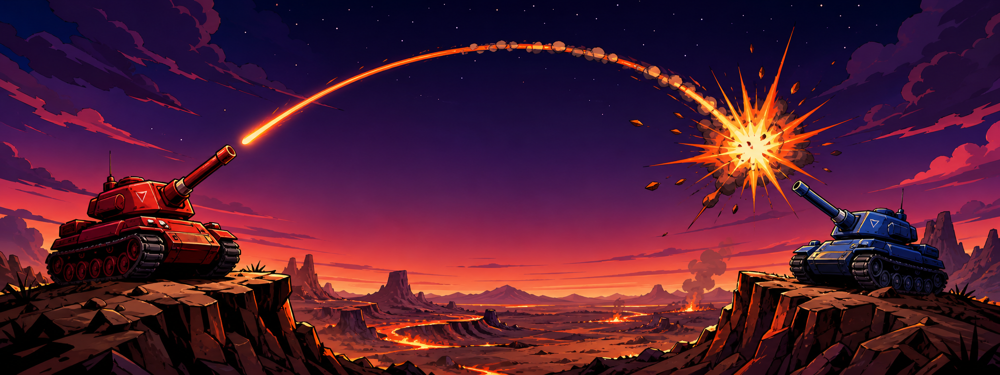
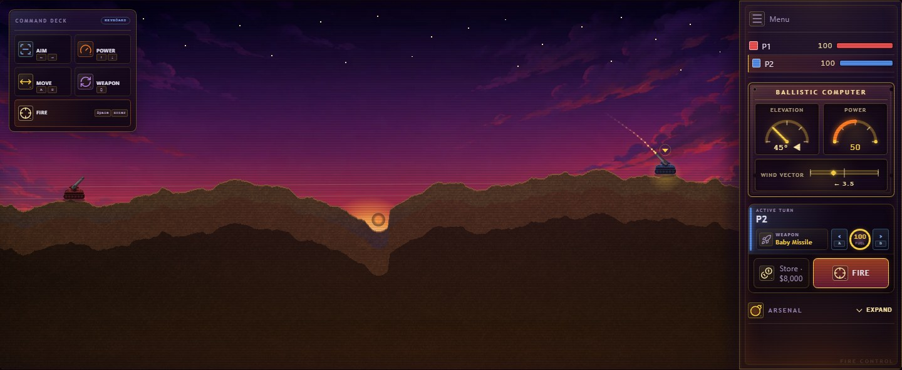
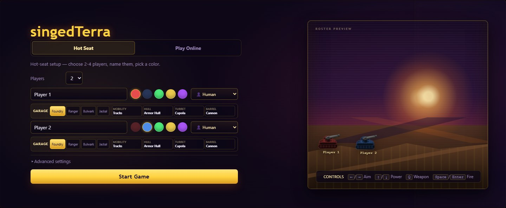

<p align="center">
  
</p>

<h1 align="center">singedTerra</h1>

<p align="center">
  <strong>A modern browser artillery game with old-school consequences.</strong><br />
  Read the wind. Shape the ground. Spend carefully. Make the shot count.
</p>

<p align="center">
  <a href="https://suadtl.github.io/singedTerra/"><strong>Play the live game</strong></a>
  &nbsp;·&nbsp;
  <a href="docs/PLAYING.md">How to play</a>
  &nbsp;·&nbsp;
  <a href="docs/README.md">Documentation</a>
</p>

<p align="center">
  <a href="https://github.com/SUaDtL/singedTerra/actions/workflows/ci.yml"></a>
  
  
  
  <a href="LICENSE"></a>
</p>

singedTerra is a from-scratch tribute to Wendell Hicken's *Scorched Earth*
(1991). It keeps the core artillery loop intact: choose an angle, judge the
wind, commit to a power setting, and watch the terrain remember what happened.

The game is playable in one browser as a 2–4 player hot-seat match or online
through public and private Supabase rooms. Computer seats use the same
deterministic physics as human players.

<p align="center">
  
</p>

## The battlefield changes every turn

- **Terrain is physical.** Explosions carve real holes from a per-pixel bitmap.
  Unsupported ground collapses, tanks settle into craters, and dirt weapons
  build new cover.
- **Wind matters.** Every round is seeded, every turn gets a deterministic wind
  vector, and every client resolves the same flight.
- **The arsenal changes the problem.** Sixteen weapons cover direct fire,
  airbursts, bouncing explosives, napalm, terrain construction, tunneling, and
  defense.
- **Movement costs fuel.** Repositioning can rescue a firing lane or strand a
  tank before the decisive turn.
- **Money carries weight.** Damage earns credits. Ammo, shields, batteries, and
  fuel compete for the same budget across multi-round matches.
- **The presentation is part of the game.** Authored tanks, a dusk battlefield,
  ballistic instruments, impact lighting, screen shake, and synthesized audio
  turn deterministic state into a readable combat scene.

## Build a tank before you fire one

Every seat has a Garage. Start from Foundry, Ranger, Bulwark, or Jackal, then
mix mobility, hull, turret, and barrel parts into a custom silhouette. The
selected loadout appears in the roster preview and carries into the match.

<p align="center">
  
</p>

## Controls

| Input | Action |
|---|---|
| `←` / `→` | Aim the barrel left or right |
| `↑` / `↓` | Raise or lower power |
| `A` / `D` | Move left or right and spend fuel |
| `Q` | Cycle the selected weapon |
| `Space` / `Enter` | Fire or activate the selected shield |
| `G` | Toggle trajectory guidance |
| `M` | Mute or restore synthesized audio |
| Hold `F` | Fast-forward the current shot locally |

Touch layouts replace the keyboard deck with an eight-control dock for aim,
power, movement, weapon selection, and Menu. Fire, Store, fuel, and Arsenal
remain in the tactical rail.
On desktop, dragging outward from the active tank sets angle and power without
firing.
See [How to play](docs/PLAYING.md) for the full turn loop, online rooms, economy,
and weapon families.

## One engine, two ways to play

Hot-seat and online matches do not use different physics.

- **Hot-seat:** `HotSeatClient` runs the shared engine directly in the browser.
- **Online:** every browser runs its own copy of the same engine. Supabase
  validates room actions, assigns sequence numbers, stores the ordered log, and
  broadcasts committed rows through Realtime.

The canonical online match is a seed plus an ordered action log. Game state is
reconstructed locally, not streamed from a ticking server. This makes fixed
timesteps, seeded randomness, and replay parity non-negotiable.

[Read the architecture guide](docs/ARCHITECTURE.md) for the runtime flow,
terrain model, trust boundary, and determinism rules.

## Run it locally

Requirements: Node 24 LTS and npm.

```bash
git clone https://github.com/SUaDtL/singedTerra.git
cd singedTerra
npm install
npm run dev
```

Vite serves the client at `http://localhost:5173`. Hot-seat play needs no
backend configuration.

For online play, copy `client/.env.example` to `client/.env` and provide:

```dotenv
VITE_SUPABASE_URL=https://your-project-id.supabase.co
VITE_SUPABASE_ANON_KEY=your-anon-key
```

The anon key is expected to ship in the public client. Row-Level Security and
Edge Function validation protect server-side data.

## Verify a change

```bash
npm run check          # typecheck plus deterministic engine harnesses
npm run test:client    # Vitest client and DOM tests
npm run check:edge     # Deno tests for Supabase Edge Functions
npm run test:e2e       # production Chromium layout and gameplay checks
npm run build          # production client bundle
```

CI runs the same core gates on every pull request. Changes under
`shared/src/engine/` must preserve deterministic replay.

## Documentation

| Need | Start here |
|---|---|
| Learn the turn loop and controls | [Playing singedTerra](docs/PLAYING.md) |
| Understand the system | [Architecture](docs/ARCHITECTURE.md) |
| Set up, test, or deploy | [Development and operations](docs/DEVELOPMENT.md) |
| Work on the interface or art | [UI system](docs/UI_SYSTEM.md) |
| Read the current product contract | [Specification](docs/SPEC.md) |
| Find every maintained and historical document | [Documentation index](docs/README.md) |

## Repository map

```text
client/                 Vite app, Canvas renderers, HTML HUD, input, lobby
shared/                 deterministic engine, replay logic, and shared types
supabase/               Postgres migrations and stateless Edge Function referees
scripts/checks/          deterministic engine and contract harnesses
e2e/                    production-browser gameplay and layout guardrails
docs/                   player, architecture, development, and project records
```

## Contributing and security

Read [CONTRIBUTING.md](CONTRIBUTING.md) before changing the engine or network
contract. Report security issues privately through
[GitHub's vulnerability reporting flow](SECURITY.md).

## Homage

singedTerra is a personal project built with deep affection for *Scorched
Earth* and the artillery games it inspired. It is not affiliated with or
endorsed by the original authors.

Released under the [MIT License](LICENSE).
