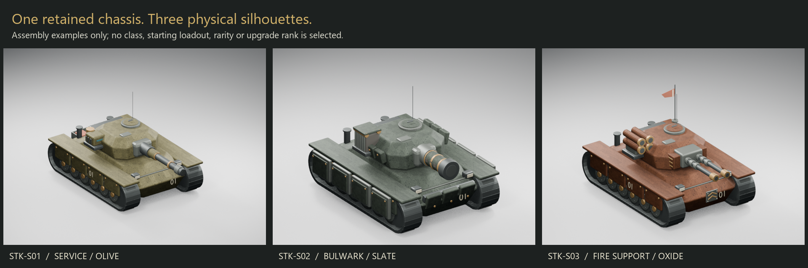
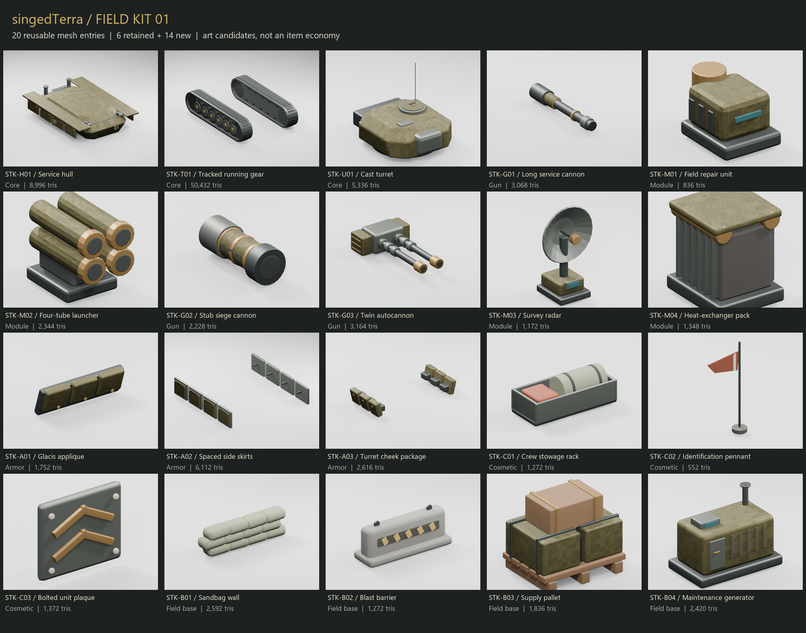

# singedTerra - Field Kit 01

Twenty reusable mesh entries, three paint finishes and three assembled examples. Six entries are extracted from the retained starter tank; fourteen are new original geometry. IDs are stable art references, not game-item, rarity, Skill or entitlement IDs.

## Status and scope

Blender generation and Unity import completed. Every entry has a separate FBX and Unity prefab; the source preserves editable component meshes and modifiers. The static Unity layout is available. The optional interactive gallery control append was blocked and remains unimplemented; there is no new Web build or gallery-input pass. These previews are Blender renders of actual meshes, not Unity screenshots.

Names suggest physical identities only. No damage, repair, heat, radar, movement, income, cover, inventory, purchase, unlock or new slot rules are attached. Field props are scenery; cosmetics carry no stats. Existing encounter rules and classic artillery are unchanged.

## Core

| ID / preview | Piece | Art mount | Triangles | Width / height / depth, m | Files |
|---|---|---|---:|---|---|
| [STK-H01](docs/parts-library-01/previews/STK-H01.png) | Service hull | `chassis` | 8,996 | 4.32 / 1.48 / 5.90 | [FBX](Unity/Assets/Art/PartsLibrary/STK-H01.fbx) / [Prefab](Unity/Assets/PartsLibrary/Prefabs/STK-H01.prefab) |
| [STK-T01](docs/parts-library-01/previews/STK-T01.png) | Tracked running gear | `chassis` | 50,432 | 4.19 / 1.49 / 6.10 | [FBX](Unity/Assets/Art/PartsLibrary/STK-T01.fbx) / [Prefab](Unity/Assets/PartsLibrary/Prefabs/STK-T01.prefab) |
| [STK-U01](docs/parts-library-01/previews/STK-U01.png) | Cast turret | `turret-ring` | 5,336 | 2.53 / 2.35 / 3.14 | [FBX](Unity/Assets/Art/PartsLibrary/STK-U01.fbx) / [Prefab](Unity/Assets/PartsLibrary/Prefabs/STK-U01.prefab) |

## Gun

| ID / preview | Piece | Art mount | Triangles | Width / height / depth, m | Files |
|---|---|---|---:|---|---|
| [STK-G01](docs/parts-library-01/previews/STK-G01.png) | Long service cannon | `gun-breech` | 3,068 | 0.52 / 0.52 / 3.18 | [FBX](Unity/Assets/Art/PartsLibrary/STK-G01.fbx) / [Prefab](Unity/Assets/PartsLibrary/Prefabs/STK-G01.prefab) |
| [STK-G02](docs/parts-library-01/previews/STK-G02.png) | Stub siege cannon | `gun-breech` | 2,228 | 0.74 / 0.74 / 1.87 | [FBX](Unity/Assets/Art/PartsLibrary/STK-G02.fbx) / [Prefab](Unity/Assets/PartsLibrary/Prefabs/STK-G02.prefab) |
| [STK-G03](docs/parts-library-01/previews/STK-G03.png) | Twin autocannon | `gun-breech` | 3,164 | 1.65 / 0.63 / 2.75 | [FBX](Unity/Assets/Art/PartsLibrary/STK-G03.fbx) / [Prefab](Unity/Assets/PartsLibrary/Prefabs/STK-G03.prefab) |

## Module

| ID / preview | Piece | Art mount | Triangles | Width / height / depth, m | Files |
|---|---|---|---:|---|---|
| [STK-M01](docs/parts-library-01/previews/STK-M01.png) | Field repair unit | `side-saddle` | 836 | 0.74 / 0.66 / 1.07 | [FBX](Unity/Assets/Art/PartsLibrary/STK-M01.fbx) / [Prefab](Unity/Assets/PartsLibrary/Prefabs/STK-M01.prefab) |
| [STK-M02](docs/parts-library-01/previews/STK-M02.png) | Four-tube launcher | `side-saddle` | 2,344 | 0.76 / 1.02 / 1.18 | [FBX](Unity/Assets/Art/PartsLibrary/STK-M02.fbx) / [Prefab](Unity/Assets/PartsLibrary/Prefabs/STK-M02.prefab) |
| [STK-M03](docs/parts-library-01/previews/STK-M03.png) | Survey radar | `side-saddle` | 1,172 | 1.20 / 1.94 / 0.87 | [FBX](Unity/Assets/Art/PartsLibrary/STK-M03.fbx) / [Prefab](Unity/Assets/PartsLibrary/Prefabs/STK-M03.prefab) |
| [STK-M04](docs/parts-library-01/previews/STK-M04.png) | Heat-exchanger pack | `side-saddle` | 1,348 | 0.76 / 0.92 / 0.86 | [FBX](Unity/Assets/Art/PartsLibrary/STK-M04.fbx) / [Prefab](Unity/Assets/PartsLibrary/Prefabs/STK-M04.prefab) |

## Armor

| ID / preview | Piece | Art mount | Triangles | Width / height / depth, m | Files |
|---|---|---|---:|---|---|
| [STK-A01](docs/parts-library-01/previews/STK-A01.png) | Glacis applique | `hull-front` | 1,752 | 2.22 / 0.70 / 0.47 | [FBX](Unity/Assets/Art/PartsLibrary/STK-A01.fbx) / [Prefab](Unity/Assets/PartsLibrary/Prefabs/STK-A01.prefab) |
| [STK-A02](docs/parts-library-01/previews/STK-A02.png) | Spaced side skirts | `chassis` | 6,112 | 4.88 / 0.88 / 4.82 | [FBX](Unity/Assets/Art/PartsLibrary/STK-A02.fbx) / [Prefab](Unity/Assets/PartsLibrary/Prefabs/STK-A02.prefab) |
| [STK-A03](docs/parts-library-01/previews/STK-A03.png) | Turret cheek package | `turret-ring` | 2,616 | 3.07 / 0.49 / 1.43 | [FBX](Unity/Assets/Art/PartsLibrary/STK-A03.fbx) / [Prefab](Unity/Assets/PartsLibrary/Prefabs/STK-A03.prefab) |

## Cosmetic

| ID / preview | Piece | Art mount | Triangles | Width / height / depth, m | Files |
|---|---|---|---:|---|---|
| [STK-C01](docs/parts-library-01/previews/STK-C01.png) | Crew stowage rack | `hull-rear` | 1,272 | 1.70 / 0.62 / 0.76 | [FBX](Unity/Assets/Art/PartsLibrary/STK-C01.fbx) / [Prefab](Unity/Assets/PartsLibrary/Prefabs/STK-C01.prefab) |
| [STK-C02](docs/parts-library-01/previews/STK-C02.png) | Identification pennant | `turret-rear` | 552 | 0.83 / 1.65 / 0.26 | [FBX](Unity/Assets/Art/PartsLibrary/STK-C02.fbx) / [Prefab](Unity/Assets/PartsLibrary/Prefabs/STK-C02.prefab) |
| [STK-C03](docs/parts-library-01/previews/STK-C03.png) | Bolted unit plaque | `hull-front` | 1,372 | 0.56 / 0.48 / 0.08 | [FBX](Unity/Assets/Art/PartsLibrary/STK-C03.fbx) / [Prefab](Unity/Assets/PartsLibrary/Prefabs/STK-C03.prefab) |

## Field base

| ID / preview | Piece | Art mount | Triangles | Width / height / depth, m | Files |
|---|---|---|---:|---|---|
| [STK-B01](docs/parts-library-01/previews/STK-B01.png) | Sandbag wall | `ground` | 2,592 | 3.35 / 0.97 / 0.59 | [FBX](Unity/Assets/Art/PartsLibrary/STK-B01.fbx) / [Prefab](Unity/Assets/PartsLibrary/Prefabs/STK-B01.prefab) |
| [STK-B02](docs/parts-library-01/previews/STK-B02.png) | Blast barrier | `ground` | 1,272 | 3.00 / 1.28 / 0.94 | [FBX](Unity/Assets/Art/PartsLibrary/STK-B02.fbx) / [Prefab](Unity/Assets/PartsLibrary/Prefabs/STK-B02.prefab) |
| [STK-B03](docs/parts-library-01/previews/STK-B03.png) | Supply pallet | `ground` | 1,836 | 1.61 / 1.36 / 1.24 | [FBX](Unity/Assets/Art/PartsLibrary/STK-B03.fbx) / [Prefab](Unity/Assets/PartsLibrary/Prefabs/STK-B03.prefab) |
| [STK-B04](docs/parts-library-01/previews/STK-B04.png) | Maintenance generator | `ground` | 2,420 | 2.25 / 1.74 / 1.35 | [FBX](Unity/Assets/Art/PartsLibrary/STK-B04.fbx) / [Prefab](Unity/Assets/PartsLibrary/Prefabs/STK-B04.prefab) |

## Three assembly examples

| ID | Appearance | Reused pieces |
|---|---|---|
| STK-S01 | Service, olive | H01 + T01 + U01 + G01 + M01 + C01 |
| STK-S02 | Bulwark, slate | H01 + T01 + U01 + G02 + M04 + A01 + A02 + A03 |
| STK-S03 | Fire support, oxide | H01 + T01 + U01 + G03 + M02 + C02 + C03 |

All abbreviated IDs above have the `STK-` prefix. Assembly prefabs are in `Unity/Assets/PartsLibrary/Prefabs/`. These are independently editable examples, not approved game classes. The three `KitPaint_Olive`, `KitPaint_Oxide`, and `KitPaint_Slate` materials tint the retained armor texture; non-armor materials keep their identity.

## Assembly and coordinate contract

Library Unity forward is -Z and up is +Y; dimensions use meters. FBX internal conversion transforms are retained inside identity wrapper prefabs. Do not replace those imported transforms with arbitrary scale=1 on every child. Art mount names are compatibility examples for this kit, not the selected hardware-slot taxonomy.

| Mount | Position in Unity | Parent |
|---|---|---|
| chassis | (0, 0, 0) | assembly root |
| turret-ring | (0, 1.77, 0) | assembly root; turret pose pivot |
| gun-breech | (0, 0.46, -1.17) | turret pivot |
| side-saddle | (1.34, 0.30, 0.40) | turret pivot |
| hull-front, applique | (0, 1.14, -2.73) | assembly root |
| hull-rear, rack | (0, 1.05, 2.64) | assembly root |

Cheek armor uses the turret origin. The pennant and unit plaque use the positions in `PartsLibraryImport.Assembly`. The static examples do not implement aiming, recoil, damage or interchangeable live equipment. Integrating a gun requires the existing presentation owner and explicit muzzle/recoil bindings; never infer gameplay from mesh dimensions.

## Authoring and verification entry points

- Editable source: `ArtSource/PartsLibrary_01.blend`; each stable ID owns its own collection. Individual meshes/modifiers are retained. Existing original art was not replaced.
- Machine-readable inventory: `Unity/Assets/Art/PartsLibrary/catalog.json`; includes provenance, source/FBX hashes, material names, mesh/triangle counts and authored bounds.
- Unity measurements: `Unity/Assets/PartsLibrary/import-receipt.json`; actual transformed-vertex bounds and triangle counts, not only conservative Renderer bounds.
- Static authoring layout: `Unity/Assets/PartsLibrary/PartsLibrary_Layout.unity`. Open it in Unity to inspect the 20 pieces and three assemblies. It is not the unfinished interactive gallery.
- Generator: `Tools/build_parts_library.py`, run through Blender in a fresh task copy. It refuses existing library art/source outputs. Never regenerate over artist edits.
- Import preparation: `PartsLibraryImport.Prepare` in `Unity/Assets/Editor/PartsLibraryImport.cs`; existing library directories are refused. Normal use loads saved prefabs rather than regenerating.
- Preview and index tools: `Tools/render_parts_library.py` and `Tools/index_parts_library.py`. Preview creation also refuses an existing preview set.

## Limits to carry into the CLI handoff

Blender nominal triangulation totals 101,280; Unity reports 100,720. Nine entries differ. A separate FBX reimport reproduces the Blender counts and detects near-zero-area triangles in several meshes, but does not establish a complete importer face mapping. Both counts and the probe are retained; topology equivalence is NOT certified. No LODs, collision meshes, sockets for a general equipment system, animated track rig, production animation set, final texture atlas, mobile resource budget or cosmetic entitlement rules are certified. STK-T01 retains 50,432 triangles and is the largest optimization candidate; this is measured geometry, not proof of a performance defect. The static assembly and technical mount list are not a freeform tank-building system.

The existing FieldAssembly scene and encounter runtime are unchanged. Previous encounter/art/inspection passes remain tied to their existing build; they were not rerun as library tests. This asset pass compiled/imported in Unity but has no new browser/phone performance or final owner art acceptance. The existing six WebGL warnings and three shader diagnostics were not addressed.

The interactive gallery script append was blocked before completion and preserved outside Unity source. Its control methods were not completed through another route, executed or committed. The library, static layout, index and previews are independent deliverables; do not call the optional gallery finished.

Next product planning is separate: decide the first-run and first-upgrade experience using selected art IDs, then issue one bounded CLI-agent implementation slice. This index grants no progression, pricing, reward or release authority.
