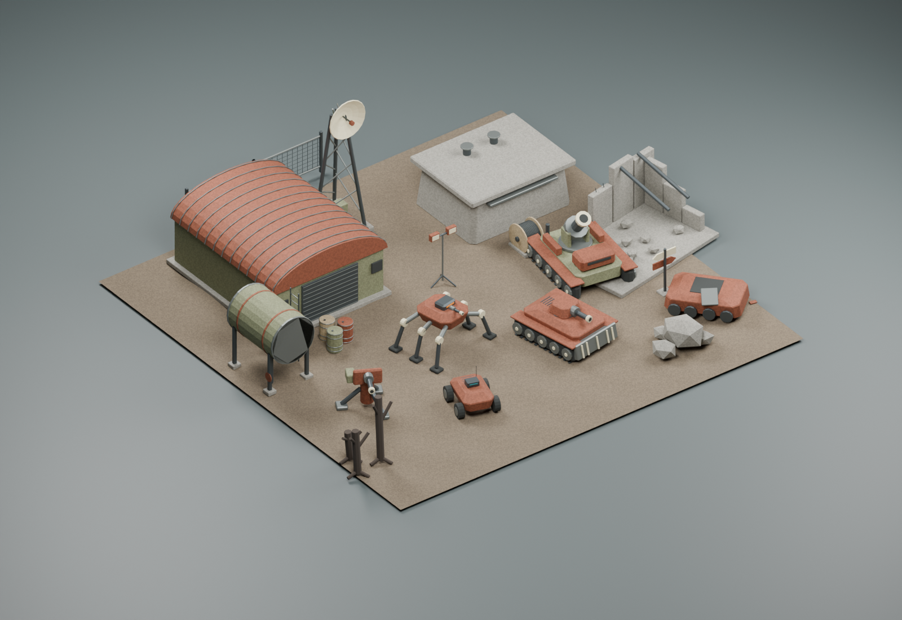
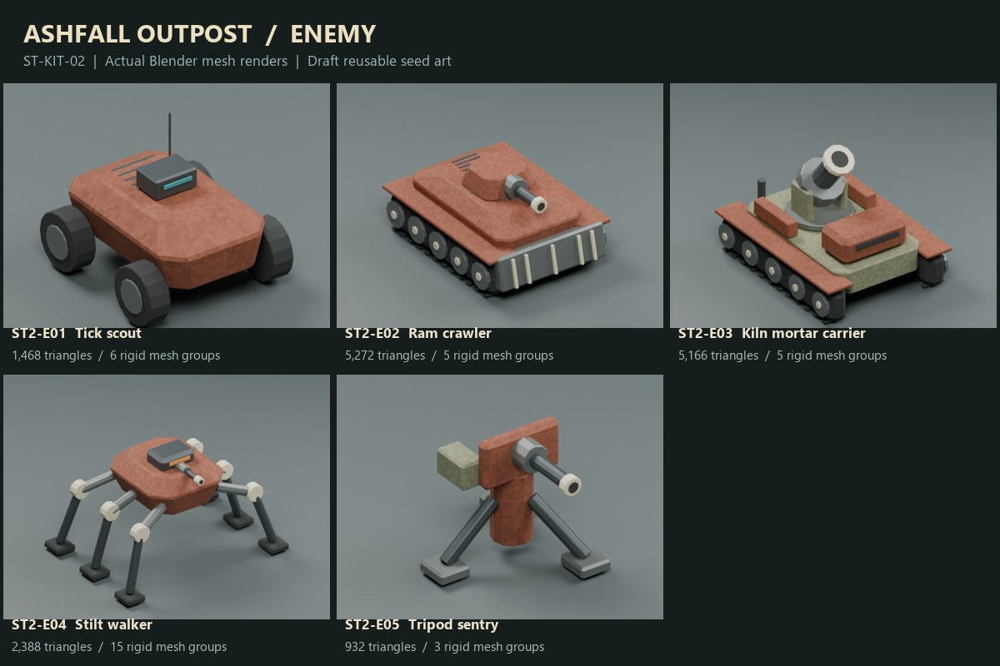
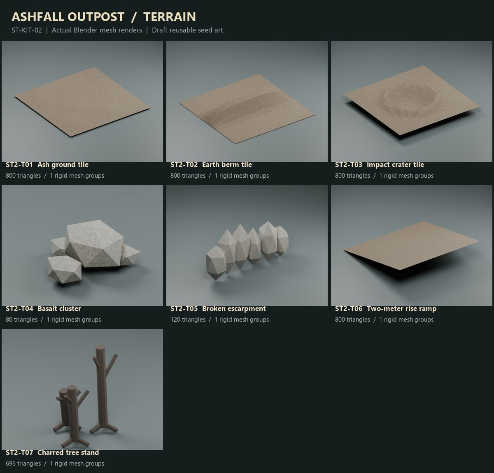
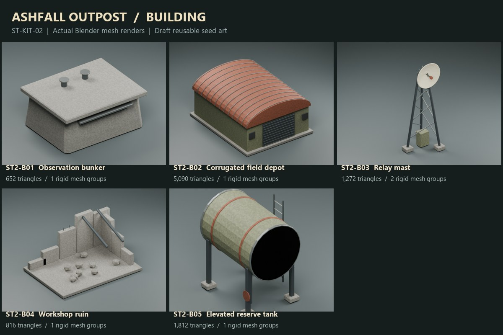
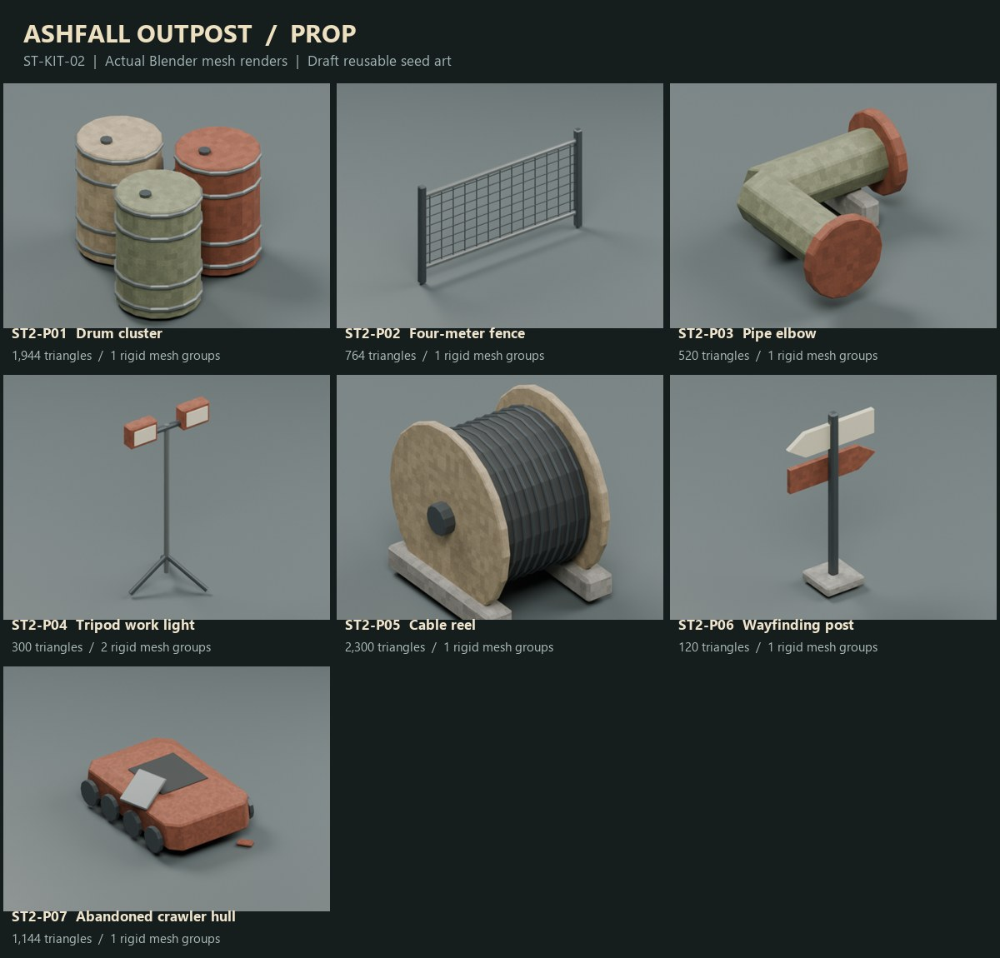

# Ashfall Outpost / Seed Pack 02

24 original assets + 5 reduced-detail enemy variants. All previews render the actual editable geometry.

[CLI handoff](docs/seed-pack-02/CLI-HANDOFF.md) | [Catalog](Unity/Assets/SeedPack02/catalog.json) | [Source](ArtSource/Ashfall_Outpost_02.blend)

## Enemy

| Art ID | Name | Triangles | FBX | GLB |
|---|---|---:|---|---|
| [ST2-E01](docs/seed-pack-02/previews/ST2-E01.png) | Tick scout | 1,468 | [FBX](Unity/Assets/SeedPack02/Models/ST2-E01.fbx) | [GLB](docs/seed-pack-02/glb/ST2-E01.glb) |
| [ST2-E02](docs/seed-pack-02/previews/ST2-E02.png) | Ram crawler | 5,272 | [FBX](Unity/Assets/SeedPack02/Models/ST2-E02.fbx) | [GLB](docs/seed-pack-02/glb/ST2-E02.glb) |
| [ST2-E03](docs/seed-pack-02/previews/ST2-E03.png) | Kiln mortar carrier | 5,166 | [FBX](Unity/Assets/SeedPack02/Models/ST2-E03.fbx) | [GLB](docs/seed-pack-02/glb/ST2-E03.glb) |
| [ST2-E04](docs/seed-pack-02/previews/ST2-E04.png) | Stilt walker | 2,388 | [FBX](Unity/Assets/SeedPack02/Models/ST2-E04.fbx) | [GLB](docs/seed-pack-02/glb/ST2-E04.glb) |
| [ST2-E05](docs/seed-pack-02/previews/ST2-E05.png) | Tripod sentry | 932 | [FBX](Unity/Assets/SeedPack02/Models/ST2-E05.fbx) | [GLB](docs/seed-pack-02/glb/ST2-E05.glb) |

## Terrain

| Art ID | Name | Triangles | FBX | GLB |
|---|---|---:|---|---|
| [ST2-T01](docs/seed-pack-02/previews/ST2-T01.png) | Ash ground tile | 800 | [FBX](Unity/Assets/SeedPack02/Models/ST2-T01.fbx) | [GLB](docs/seed-pack-02/glb/ST2-T01.glb) |
| [ST2-T02](docs/seed-pack-02/previews/ST2-T02.png) | Earth berm tile | 800 | [FBX](Unity/Assets/SeedPack02/Models/ST2-T02.fbx) | [GLB](docs/seed-pack-02/glb/ST2-T02.glb) |
| [ST2-T03](docs/seed-pack-02/previews/ST2-T03.png) | Impact crater tile | 800 | [FBX](Unity/Assets/SeedPack02/Models/ST2-T03.fbx) | [GLB](docs/seed-pack-02/glb/ST2-T03.glb) |
| [ST2-T04](docs/seed-pack-02/previews/ST2-T04.png) | Basalt cluster | 80 | [FBX](Unity/Assets/SeedPack02/Models/ST2-T04.fbx) | [GLB](docs/seed-pack-02/glb/ST2-T04.glb) |
| [ST2-T05](docs/seed-pack-02/previews/ST2-T05.png) | Broken escarpment | 120 | [FBX](Unity/Assets/SeedPack02/Models/ST2-T05.fbx) | [GLB](docs/seed-pack-02/glb/ST2-T05.glb) |
| [ST2-T06](docs/seed-pack-02/previews/ST2-T06.png) | Two-meter rise ramp | 800 | [FBX](Unity/Assets/SeedPack02/Models/ST2-T06.fbx) | [GLB](docs/seed-pack-02/glb/ST2-T06.glb) |
| [ST2-T07](docs/seed-pack-02/previews/ST2-T07.png) | Charred tree stand | 696 | [FBX](Unity/Assets/SeedPack02/Models/ST2-T07.fbx) | [GLB](docs/seed-pack-02/glb/ST2-T07.glb) |

## Building

| Art ID | Name | Triangles | FBX | GLB |
|---|---|---:|---|---|
| [ST2-B01](docs/seed-pack-02/previews/ST2-B01.png) | Observation bunker | 652 | [FBX](Unity/Assets/SeedPack02/Models/ST2-B01.fbx) | [GLB](docs/seed-pack-02/glb/ST2-B01.glb) |
| [ST2-B02](docs/seed-pack-02/previews/ST2-B02.png) | Corrugated field depot | 5,090 | [FBX](Unity/Assets/SeedPack02/Models/ST2-B02.fbx) | [GLB](docs/seed-pack-02/glb/ST2-B02.glb) |
| [ST2-B03](docs/seed-pack-02/previews/ST2-B03.png) | Relay mast | 1,272 | [FBX](Unity/Assets/SeedPack02/Models/ST2-B03.fbx) | [GLB](docs/seed-pack-02/glb/ST2-B03.glb) |
| [ST2-B04](docs/seed-pack-02/previews/ST2-B04.png) | Workshop ruin | 816 | [FBX](Unity/Assets/SeedPack02/Models/ST2-B04.fbx) | [GLB](docs/seed-pack-02/glb/ST2-B04.glb) |
| [ST2-B05](docs/seed-pack-02/previews/ST2-B05.png) | Elevated reserve tank | 1,812 | [FBX](Unity/Assets/SeedPack02/Models/ST2-B05.fbx) | [GLB](docs/seed-pack-02/glb/ST2-B05.glb) |

## Prop

| Art ID | Name | Triangles | FBX | GLB |
|---|---|---:|---|---|
| [ST2-P01](docs/seed-pack-02/previews/ST2-P01.png) | Drum cluster | 1,944 | [FBX](Unity/Assets/SeedPack02/Models/ST2-P01.fbx) | [GLB](docs/seed-pack-02/glb/ST2-P01.glb) |
| [ST2-P02](docs/seed-pack-02/previews/ST2-P02.png) | Four-meter fence | 764 | [FBX](Unity/Assets/SeedPack02/Models/ST2-P02.fbx) | [GLB](docs/seed-pack-02/glb/ST2-P02.glb) |
| [ST2-P03](docs/seed-pack-02/previews/ST2-P03.png) | Pipe elbow | 520 | [FBX](Unity/Assets/SeedPack02/Models/ST2-P03.fbx) | [GLB](docs/seed-pack-02/glb/ST2-P03.glb) |
| [ST2-P04](docs/seed-pack-02/previews/ST2-P04.png) | Tripod work light | 300 | [FBX](Unity/Assets/SeedPack02/Models/ST2-P04.fbx) | [GLB](docs/seed-pack-02/glb/ST2-P04.glb) |
| [ST2-P05](docs/seed-pack-02/previews/ST2-P05.png) | Cable reel | 2,300 | [FBX](Unity/Assets/SeedPack02/Models/ST2-P05.fbx) | [GLB](docs/seed-pack-02/glb/ST2-P05.glb) |
| [ST2-P06](docs/seed-pack-02/previews/ST2-P06.png) | Wayfinding post | 120 | [FBX](Unity/Assets/SeedPack02/Models/ST2-P06.fbx) | [GLB](docs/seed-pack-02/glb/ST2-P06.glb) |
| [ST2-P07](docs/seed-pack-02/previews/ST2-P07.png) | Abandoned crawler hull | 1,144 | [FBX](Unity/Assets/SeedPack02/Models/ST2-P07.fbx) | [GLB](docs/seed-pack-02/glb/ST2-P07.glb) |

