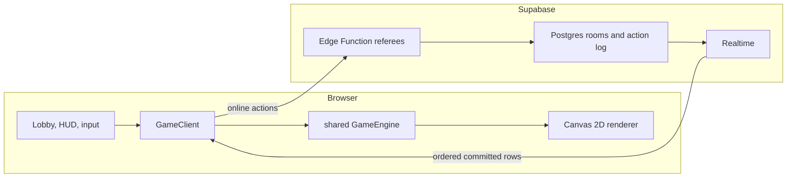

# Architecture

singedTerra has one deterministic game engine and two execution contexts. The
browser owns rendering and input in both modes. Supabase coordinates online
rooms but never runs a continuous physics loop.



## Runtime modes

### Hot seat

`HotSeatClient` wraps `GameEngine` directly. Player actions are applied in the
same tab, and the engine ticks on `requestAnimationFrame`. No Supabase import,
environment variable, or network round trip is required.

### Online

`NetworkClient` also owns a local `GameEngine`. Committed movement, purchases,
round transitions, and turn-ending actions are posted to the applicable Edge
Function. The server validates room membership and turn rules, allocates the
next sequence number, and commits a row to `room_actions`.

Supabase Realtime broadcasts committed rows. Every client buffers them by
sequence number and applies them through the shared replay adapter. Physics,
terrain deformation, damage, CPU planning, and visual state are regenerated
locally.

The canonical online match is:

```text
room options + seed + ordered room_actions
```

`GameState` is not streamed between clients.

## Dependency direction

```text
client/  ───────────────► shared/
supabase/functions/     (independent stateless referees)
shared/                 (imports from neither client nor Supabase)
```

- `shared/` contains deterministic engine code, replay translation, and shared
  types.
- `client/` contains renderers, input, UI, audio, hot-seat orchestration, and
  online transport.
- `supabase/functions/` runs in Deno and validates request and database
  contracts. It does not import or execute the shared physics engine.

## Determinism contract

Networked play depends on every browser reaching the same state from the same
ordered inputs.

- Physics advances in a fixed 16 ms timestep.
- `shared/src/engine/` does not read wall-clock time.
- Randomness comes from seeded generators, never mid-flight `Math.random()`.
- Turn, round, wind, terrain, and CPU decisions are derived from deterministic
  inputs.
- Replay uses the same action application path as live play.
- Changes to engine behavior must extend a harness under `scripts/checks/`.

## Turn and round state

The engine moves through:

```text
LOBBY → PLAYER_TURN → FIRING → RESOLVING → ROUND_OVER → GAME_OVER
```

Human input is accepted only during `PLAYER_TURN`. A projectile or area effect
keeps the engine in a resolving phase until the outcome is stable. Multi-round
matches derive a new round seed while carrying credits, inventory, and score.

## Terrain

Terrain is a `Uint8Array` for an 800×500 logical battlefield. Each byte answers
whether one pixel is solid.

This representation gives the engine:

- constant-time point collision;
- real disc-shaped craters;
- terrain-raising weapons;
- deterministic column collapse;
- tank settlement and burial;
- a compact, replayable source of truth.

The renderer caches the visual terrain surface and rebuilds it only when
`terrainVersion` changes. Collision remains crisp even when visual materials
and lighting are richer.

## Action contract

The shared player action and replay types define the behavior that must agree
between hot-seat, online clients, and Edge Function validation.

Important paths:

```text
shared/src/types/PlayerAction.ts
shared/src/net/replay.ts
client/src/client/NetworkClient.ts
supabase/functions/submit_action/
```

Angle, power, weapon selection, movement, purchases, shield use, firing, and
round transitions each have explicit replay behavior. The server assigns
ordering; the engine determines physical results.

## Trust boundary

Online play uses ephemeral room identities rather than end-user accounts.

- The Supabase anon key is public and shipped with the client.
- Row-Level Security denies direct anonymous mutations.
- Edge Functions hold the service-role key and perform validated writes.
- Gameplay integrity is designed for casual rooms, not adversarial ranked play.
- Server secrets must never enter the client bundle, repository, or logs.

Read [SECURITY.md](../SECURITY.md) for the accepted trust model and private
reporting path.

## Rendering and UI

The battlefield is Canvas 2D at 800×500 logical pixels. HTML and CSS own the
HUD, lobby, store, menus, and accessibility surface.

The composition is a fitted stage:

```text
authored battlefield + Canvas effects | tactical HTML rail
```

Fine pointers receive a keyboard command deck. Coarse pointers receive
touch-sized controls. The page must remain scroll-free at supported landscape
viewports. See [UI system](UI_SYSTEM.md) for the visual contract.
