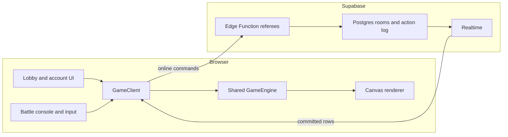

# Architecture

singedTerra has one deterministic engine, two live execution modes, and a
separate bounded verification path. The browser owns simulation, rendering,
and player input. Supabase coordinates online rooms and verifies eligible
completed transcripts. It does not run a continuous game server.

## Runtime map



The repository keeps dependencies moving in one direction:

```text
client/  ───────────────► shared/
supabase/functions/     independent Deno handlers
shared/                 imports from neither client nor Supabase
```

`shared/` owns the engine, replay translation, and shared types. `client/`
owns orchestration, Canvas rendering, the lobby, battle console, input, audio,
and online transport. `supabase/` owns additive migrations and stateless Edge
Function entry points.

## Hot-seat execution

`HotSeatClient` wraps `GameEngine` directly. Commands are applied in the same
tab and the engine advances through `requestAnimationFrame` in fixed ticks,
normally paced at 60 Hz by the browser frame clock. This engine path needs no
Supabase configuration or network request.

## Online lockstep

`NetworkClient` also owns a local `GameEngine`. It sends room commands to Edge
Function referees. The server validates the room, seat credential, turn,
version, and expected room revision before it commits the next ordered action.

Supabase Realtime broadcasts committed rows. Every client buffers them by
sequence number and applies each contiguous action through the shared replay
adapter. Physics, terrain deformation, damage, CPU planning, and visual state
are regenerated locally.

The canonical online match is:

```text
room options + seed + ordered room_actions
```

`GameState` is not streamed between clients.

### Compatibility values

Current browser rooms use deterministic ruleset version 4 and command protocol
version 2. The backend still recognizes stored ruleset versions 1 through 4
and command protocol versions 1 and 2 so it can reject mismatches explicitly
and preserve existing rooms.

The ruleset identifies engine and replay semantics. The command protocol
identifies command envelopes, intent identity, room revisions, and receipts.
Admission requires an exact compatible pair before roster mutation. Rejoin and
rematch keep the versions stored with the room.

## Determinism contract

Online play depends on every browser reaching the same state from the same
ordered inputs.

- Physics advances in fixed engine ticks, normally paced at 60 Hz in browser play.
- Wall-clock delta time never enters physics.
- Shared engine code does not read wall-clock time.
- Gameplay randomness comes from seeded generators.
- Turn, round, wind, terrain, and CPU decisions come from deterministic inputs.
- Live play and replay use the same action application path.
- Engine changes extend the deterministic checks under `scripts/checks/`.

The engine state machine is:

```text
LOBBY → PLAYER_TURN → FIRING → RESOLVING → ROUND_OVER → GAME_OVER
```

Human input is accepted only during `PLAYER_TURN` for the local human who owns
the active seat.

## Terrain and combat state

The logical battlefield is 1200×600. Terrain is a `Uint8Array` with one byte
per pixel. A byte records air, ordinary ground, or a material such as lava.
This representation supports constant-time point collision, swept projectile
checks, craters, raised terrain, collapse, tank settlement, and burial.

The renderer rebuilds its terrain surface only when `terrainVersion` changes.
Visual material and atmosphere never feed state back into the engine.

Important deterministic paths:

```text
shared/src/engine/GameEngine.ts
shared/src/engine/Physics.ts
shared/src/engine/Terrain.ts
shared/src/engine/WeaponSystem.ts
shared/src/net/replay.ts
shared/src/types/PlayerAction.ts
```

## Browser composition

The battlefield is Canvas 2D. The lobby and battle controls remain semantic
HTML. The current battle console uses one Preact tree for live readings and
commands, plus optional Pixi decoration beneath that tree. Typed presentation
state and typed intents keep UI ownership separate from the engine.

Responsive projection selects wide, standard, or compact console geometry.
Canvas still owns the battlefield in every mode. HTML remains the focus,
keyboard, pointer, and assistive-technology surface.

## Existing owners

Session owners keep resource lifetimes explicit:

| Owner | Responsibility |
|---|---|
| `GameSessionComposition` | Acquire client, renderer, input, subscriptions, and start order |
| `MatchSessionLifecycle` | Retire match resources and invalidate stale generations |
| `LobbyRoomController` | Create, join, recover, leave, and cancel room work |
| `LobbySession` | Waiting-room state and subscription handles |
| `HUD` and `battleConsole/` | Project engine state, render controls, and emit player intent |

## Accounts and evidence

Casual room seats use room-scoped credentials. A player account is optional and
does not replace that seat authorization. Linking a casual result to an account
records `casual_participant_reported` evidence; it does not upgrade the match to
verified evidence.

Verified Deployment is a separate authenticated path. The server allocates a
bounded session and replays the accepted transcript before returning an
immutable receipt. Supported active verified deployment tuples are `2/2/4`
and `3/3/4` for contract, engine, and ruleset. Historical receipts remain tied
to the version that produced them.

Crosswind Qualification adds another bounded verified transcript and a combined
Verified Career projection. Its new backend routes and migration are prepared,
but production release, hosted proof, and public admission enablement remain
pending. The client treats unavailable verification as unavailable. It does not
compute a medal, XP, rank, or verified match count locally.

The specialized rollout contract is documented in
[Crosswind Qualification backend rollout](deployment/verified-challenge-cq1.md).

## Trust boundary

- The Supabase anon key is public client configuration.
- Row-Level Security denies direct browser mutations that require a referee.
- Edge Functions validate commands and use server-held credentials for writes.
- Service-role credentials never enter the client bundle, repository, or logs.
- Ordinary room referees do not execute projectile physics.
- Verified replay executes only in bounded, versioned completion or probe paths.

Casual online play is designed for cooperative rooms, not adversarial ranked
competition. Read [Security Policy](../SECURITY.md) for the accepted model and
private reporting route.
