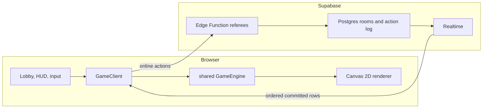

# Architecture

singedTerra has one deterministic game engine, two live execution contexts, and
one bounded verification-only context. The browser owns rendering and input.
Supabase coordinates online rooms and separately verifies eligible completed
transcripts; it never runs a continuous live physics loop.

## Current scope and sources

The [approved recovery scope](../.codearbiter/specs/evidence-recovery-v2.md)
defines the current corrections. The parent-owned
[execution ledger](../.codearbiter/plans/evidence-recovery-v2.md) is their sole
status source. A listed acceptance criterion is not an implemented fix.

| Question | Source |
| --- | --- |
| What may change now, and what evidence is required? | Approved scope and execution ledger above; the assigned task's exact write paths. |
| Which architectural decisions endure? | Accepted artifacts under `.codearbiter/decisions/`, including their explicit supersession boundaries; current coding and security contracts. |
| Who owns existing behavior? | The owner map below and its implementation files. Source and executable tests establish current behavior, including defects. |
| What was delivered previously? | [Software recovery delivery record](SOFTWARE_RECOVERY.md), with its recorded revisions and evidence limits. Older plans, decision-log entries, audit inputs, and build histories retain their historical meaning. |
| What commands and runtime contracts execute? | Current manifests, workflows, shared replay contracts, Edge handlers, and migrations. R19 owns the approved runtime/operations documentation reconciliation. |

This map replaces conflicting descriptive guidance only for the authorized
recovery. It does not amend accepted ADRs, reinterpret verified results, edit
applied migrations, or create another backlog. Preserve historical replay and
immutable receipt compatibility. Changes to those enduring contracts require
their applicable decision and compatibility evidence.

## Existing owners

| Owner | Responsibility retained during recovery |
| --- | --- |
| `client/src/client/GameSessionComposition.ts` | Ordered client acquisition, presentation/input construction, subscription wiring, and start sequencing through explicit ports. |
| `client/src/client/MatchSessionLifecycle.ts` | The match resource ledger and generation invalidation: client, input, renderer, subscriptions, timers, retirement, and rollback. |
| `client/src/client/LobbyRoomController.ts` and `LobbySession.ts` | The controller owns admission, recovery, leave, and cancellation workflows; `LobbySession` owns waiting subscriptions and their handles. |
| `client/src/ui/TerminalMatchView.ts` and `HUD.ts` | The view owns terminal DOM, listeners, focus, and presentation intents; HUD retains domain callback wiring. |
| `client/src/ui/battleConsole/` | One Preact semantic tree renders typed presentation state and emits typed intents, including its portals and focus lifecycle. Canvas owns the gameplay world; Pixi owns only optional decoration. |
| `shared/src/engine/`, `shared/src/net/replay.ts`, and the existing clients | The shared engine determines simulation outcomes; replay translates ordered actions. `HotSeatClient` and `NetworkClient` own their execution and transport paths behind `GameClient`. |

Retain these boundaries while fixing their assigned defects. This recovery has
no compulsory file-size or module-count targets and does not require another
coordinator, engine, or presentation framework.



## Runtime modes

### Hot seat

`HotSeatClient` wraps `GameEngine` directly. Player actions are applied in the
same tab, and the engine ticks on `requestAnimationFrame`. No Supabase import,
environment variable, or network round trip is required.

### Online

`NetworkClient` also owns a local `GameEngine`. Committed movement, purchases,
round transitions, and turn-ending actions are posted to the applicable Edge
Function. The server validates room membership and turn rules, allocates the
next sequence number, and commits a row to `room_actions`.

Supabase Realtime broadcasts committed rows. Every client buffers them by
sequence number and applies them through the shared replay adapter. Physics,
terrain deformation, damage, CPU planning, and visual state are regenerated
locally.

The canonical online match is:

```text
room options + seed + ordered room_actions
```

`GameState` is not streamed between clients.

### Ordinary-room compatibility

Ordinary rooms persist two independent compatibility values. They are not a
verified-replay policy and neither value is a model assignment.

- `rulesetVersion` identifies the deterministic room options and replay
  semantics. The referee recognizes stored versions `1` through `4`; a missing
  value is legacy `1`, while malformed stored data fails closed. New browser
  rooms request and store version `4`.
- `commandProtocolVersion` identifies command-envelope, identity, revision, and
  receipt semantics. It recognizes legacy version `1` and current version `2`.
  A missing value is legacy `1`; new browser rooms request version `2`.

Admission requires exact equality for both values before roster mutation.
`join_room` returns a typed 409 mismatch that names the required ruleset or
command protocol, and `submit_action` validates the command version before the
room-command RPC. Rejoin, rematch, engine construction, and retries retain the
authoritative stored values. Therefore a client cannot silently replay an
active room with newer engine or command semantics.

The v2 command envelope carries a stable intent identifier, expected room
revision, acting player, action, and optional turn-transition metadata. A
receipt and committed action row repeat that identity and revision. This is
transport/idempotency metadata, not a new gameplay ruleset.

## Dependency direction

```text
client/  ───────────────► shared/
supabase/functions/     (independent stateless referees)
shared/                 (imports from neither client nor Supabase)
```

- `shared/` contains deterministic engine code, replay translation, and shared
  types.
- `client/` contains renderers, input, UI, audio, hot-seat orchestration, and
  online transport.
- `supabase/functions/` runs in Deno and validates request and database
  contracts. Ordinary referees do not execute physics. ADR-0013 permits only
  bounded verification-only replay through `_shared/verifiedMatchReplay.ts`
  into the shared engine, outside the live turn path.

## Determinism contract

Networked play depends on every browser reaching the same state from the same
ordered inputs.

- Physics advances in a fixed 16 ms timestep.
- `shared/src/engine/` does not read wall-clock time.
- Randomness comes from seeded generators, never mid-flight `Math.random()`.
- Turn, round, wind, terrain, and CPU decisions are derived from deterministic
  inputs.
- Replay uses the same action application path as live play.
- Changes to engine behavior must extend a harness under `scripts/checks/`.

## Turn and round state

The engine moves through:

```text
LOBBY → PLAYER_TURN → FIRING → RESOLVING → ROUND_OVER → GAME_OVER
```

Human input is accepted only during `PLAYER_TURN`. A projectile or area effect
keeps the engine in a resolving phase until the outcome is stable. Multi-round
matches derive a new round seed while carrying credits, inventory, and score.

## Terrain

Terrain is a `Uint8Array` for a 1200×600 logical battlefield. Each byte answers
whether one pixel is solid.

This representation gives the engine:

- constant-time point collision;
- real disc-shaped craters;
- terrain-raising weapons;
- deterministic column collapse;
- tank settlement and burial;
- a compact, replayable source of truth.

The renderer caches the visual terrain surface and rebuilds it only when
`terrainVersion` changes. Collision remains crisp even when visual materials
and lighting are richer.

## Action contract

The shared player action and replay types define the behavior that must agree
between hot-seat, online clients, and Edge Function validation.

Important paths:

```text
shared/src/types/PlayerAction.ts
shared/src/net/replay.ts
client/src/client/NetworkClient.ts
supabase/functions/submit_action/
```

Angle, power, weapon selection, movement, purchases, shield use, firing, and
round transitions each have explicit replay behavior. The server assigns
ordering; the engine determines physical results.

## Trust boundary

Casual online gameplay uses per-seat credentials. Optional account identity is
separate from seat authorization and does not make a casual result verified.

- The Supabase anon key is public and shipped with the client.
- Row-Level Security denies direct anonymous mutations.
- Edge Functions hold the service-role key and perform validated writes.
- Gameplay integrity is designed for casual rooms, not adversarial ranked play.
- Server secrets must never enter the client bundle, repository, or logs.

Casual results and verified rewards use different evidence paths. A completed
casual room stores or links only `casual_participant_reported` evidence. Account
linkage identifies the authenticated participant and never upgrades that result
to replay-verified evidence or changes verified progression.

Verified Deployment is a separate authenticated, server-replayed mode. Its
accepted active tuples are `2/2/4` and `3/3/4`
(`contract/engine/ruleset`). The current start handler selects from those
capabilities. The older shared constants still name `2/2/4` for legacy callers;
they are not proof that `3/3/4` is unsupported. Historical completed `1/1/3`
sessions are immutable receipts: an identical completion retry returns the
stored result without replay, and no active `1/1/3` session is interpreted by a
newer engine. V1 drains before V2 admission can begin. V2 and V3 have
independent admission controls. A compatible unexpired active V2 or V3 session
resumes when the client advertises that exact tuple, even if new starts are
disabled. For a new session, the start handler selects the highest enabled tuple
advertised by the client.

Read [SECURITY.md](../SECURITY.md) for the accepted trust model and private
reporting path.

## Rendering and UI

The battlefield is Canvas 2D at 1200×600 logical pixels. ADR-0018 gives the
in-scope battle console one Preact semantic tree, including portaled settings
and first-salvo coach content. Typed presentation state and intents separate
domain behavior from rendering. Lazy, non-interactive Pixi draws console
decoration beneath the semantic tree; both consume one typed responsive layout
projection. HTML remains the accessibility and input surface. Lobby and account
routes retain their clean-load boundary.

ADR-0018 supersedes ADR-0017 only for imperative node/callback ownership and
the component-by-component migration assumption. Canvas world authority,
visual-only Pixi, deterministic asset tooling, lazy battle entry, accessibility,
and static hosting remain. The ADR-0018 artifact has an accepted header; the
older decision-log entry still describes a pending direct approval receipt.
That historical receipt has not been located in this recovery. Its provenance
is unknown; this documentation neither invents approval evidence nor changes
the accepted artifact. Any actual decision conflict goes to the owner.

The composition is a fitted stage:

```text
authored battlefield + Canvas effects | tactical HTML rail
```

Fine pointers receive a keyboard command deck. Coarse pointers receive
touch-sized controls. The page must remain scroll-free at supported landscape
viewports. See [UI system](UI_SYSTEM.md) for the visual contract.
